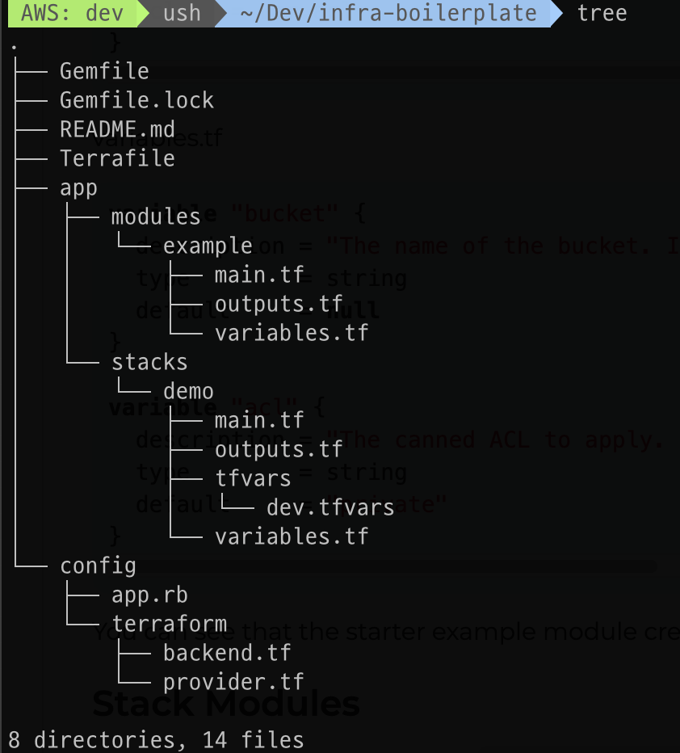

# 테라폼 프로젝트 생성/운용

## 테라폼 기본 구조 생성

1. 테라폼 프로젝트 생성
  * aws 계정 생성
    * 계정명 : terraform-admin
    * 정책 : AdministratorAccess
  * aws 환경 구성
    * aws configure --profile dev
    * cat ~/.aws/config
    * cat ~/.aws/credentials
    * 확인 : aws s3 ls --profile "dev"
  * zshrc에 환경 구성
    * vi ~/.zshrc
    * export AWS_PROFILE=dev
    * source ~/.zshrc
  * 테라폼 프로젝트 기본 구조 생성

    ```bash
    terraspace new project infra-boilerplate --plugin aws --examples
    cd infra-boilerplate
    # 생성 구조 확인
    tree
    # stack에 변수 설정
    TF_VAR=dev terraspace seed demo
    ```

    

  * 인프라 생성
    > terraspace up demo
  * 인프라 삭제
    > terraspace down demo

1. 부가 명령
  * 제거되지 않는 pod 강제 제거

    ```kubectl
    kubectl patch pod <pod 이름> -p '{"metadata":{"finalizers":null}}' -n <namespace 이름>
    kubectl delete pod <pod 이름> --grace-period=0 --force -n <namespace 이름>
    ```

  * curl을 사용하기 위한 임시 POD 생성 (종료시 destroy)
    > kubectl run curl -it --rm --image curlimages/curl -- sh

1. Grafana 접속
  * Secret 조회
    > kubectl get secret -n <namespace 이름> grafana -o jsonpath="{.data.admin-password}" | base64 --decode ; echo
  * 그라파나 포트 포워딩
    > kubectl port-forward -n <namespace 이름> service/grafana 3000:80

## HPA / CA 적용하기

1. HPA 적용
  * 쿠버네티스 클러스터 전체의 리소스 사용 데이터 수집을 위해, Metrics Server가 필요한다.
  * 작성된 테라폼의 grafana 모듈을 통해, metrics server를 설치한다.

    ```curl
    # 테라폼이 아닌 manifest파일을 통해 설치하고자 하는 경우에는 다음과 같이 한다.
    kubectl apply -f https://github.com/kubernetes-sigs/metrics-server/releases/latest/download/components.yaml
    kubectl get deployment metrics-server -n kube-system
    ```

  * 예제 deployment (# replicas의 수를 1로 조정)

    ```yaml
    apiVersion: apps/v1
    kind: Deployment
    metadata:
      name: demo-flask-backend
      namespace: default
    spec:
      replicas: 1
      selector:
        matchLabels:
          app: demo-flask-backend
      template:
        metadata:
          labels:
            app: demo-flask-backend
        spec:
          containers:
            - name: demo-flask-backend
              image: $ACCOUNT_ID.dkr.ecr.$AWS_REGION.amazonaws.com/demo-flask-backend:latest
              imagePullPolicy: Always
              ports:
                - containerPort: 8080
              resources:
                requests:
                  cpu: 250m
                limits:
                  cpu: 500m
    ```

    > kubectl apply -f flask-deployment.yaml
  * HPA 설정

    ```yaml
    apiVersion: autoscaling/v1
    kind: HorizontalPodAutoscaler
    metadata:
      name: demo-flask-backend-hpa
      namespace: default
    spec:
      scaleTargetRef:
        apiVersion: apps/v1
        kind: Deployment
        name: demo-flask-backend
      minReplicas: 1
      maxReplicas: 5
      targetCPUUtilizationPercentage: 30
    ```

    > kubectl apply -f flask-hpa.yaml  
    > kubectl get hpa  
    > kubectl get hpa -w

  * HPA 테스트 (부하 적용)
    > ab -c 200 -n 200 -t 30 http://$(kubectl get ingress/backend-ingress -o jsonpath='{.status.loadBalancer.ingress[*].hostname}')/contents/aws

1. CA 적용
  * manifest 파일 다운로드
    > wget https://raw.githubusercontent.com/kubernetes/autoscaler/master/cluster-autoscaler/cloudprovider/aws/examples/cluster-autoscaler-autodiscover.yaml
  * 내려받은 파일에서 <YOUR CLUSTER NAME> 부분을 해당 클러스터 이름으로 교체하고 저장
  * 해당 파일을 통해 cluster autoscaler를 적용
    > kubectl apply -f cluster-autoscaler-autodiscover.yaml  
  * 테스트
    * kubectl get nodes -w
    * 다른 터미널 창을 열고 아래와 같은 replicas 증가 테스트 수행
      >  kubectl create deployment autoscaler-demo --image=nginx  
      > kubectl scale deployment autoscaler-demo --replicas=100
    * pod의 진행 상태를 확인
      > kubectl get deployment autoscaler-demo --watch

1. 부하생성기 POD
  * kubectl run -i --tty load-generator --image=busybox /bin/sh
  * while true; do wget -q -O- http://<loadbalancer-url>; done